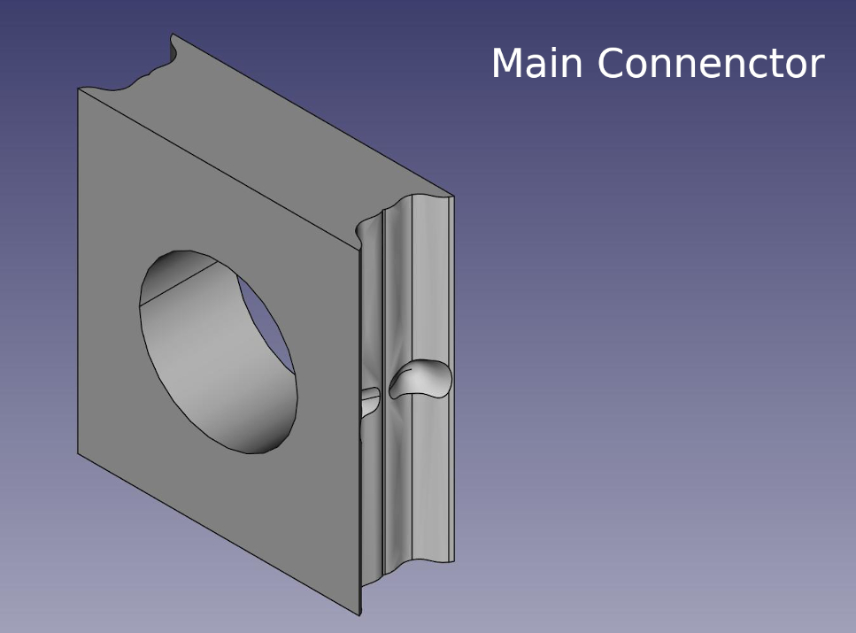
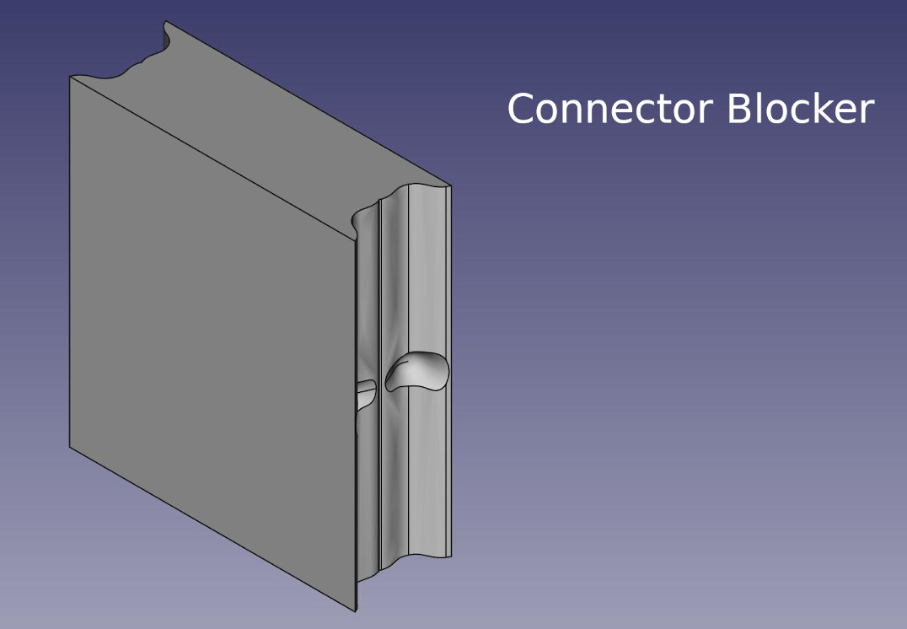
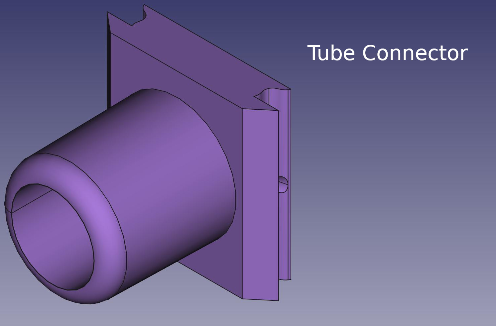
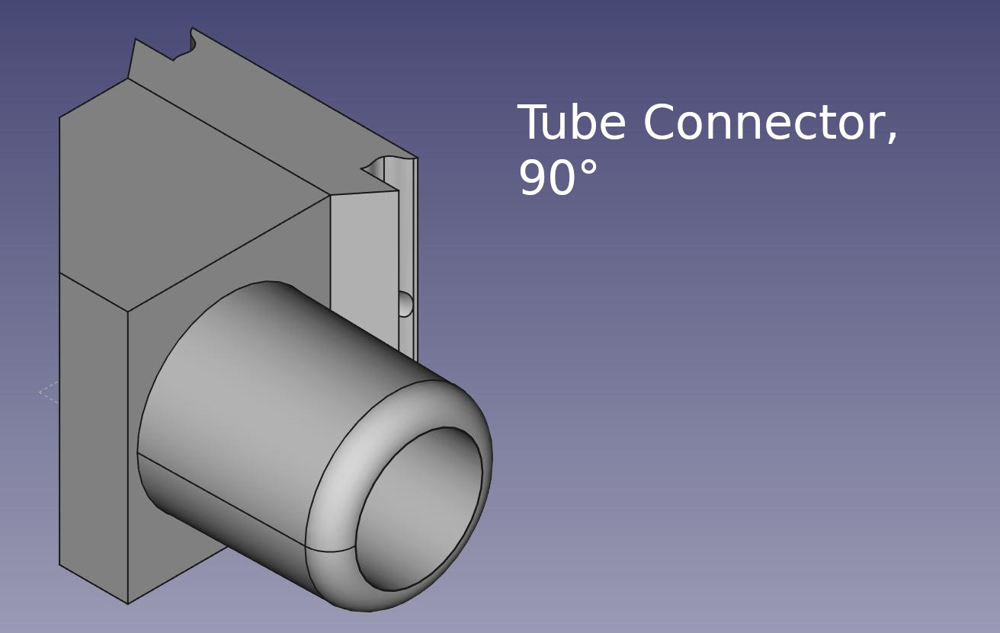
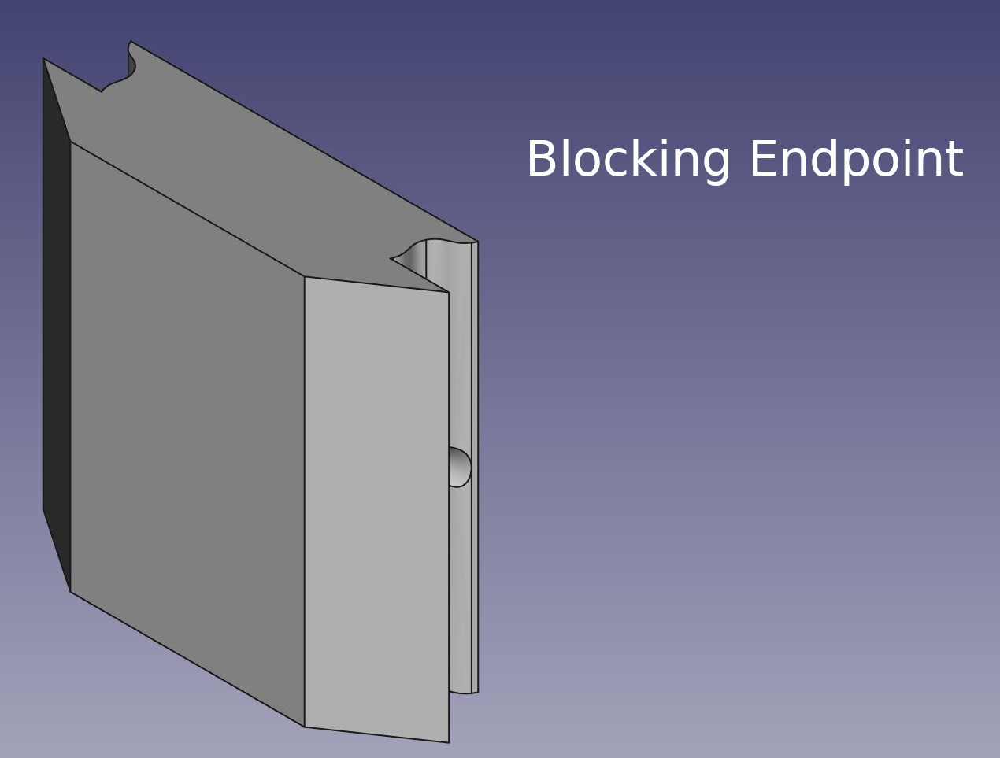
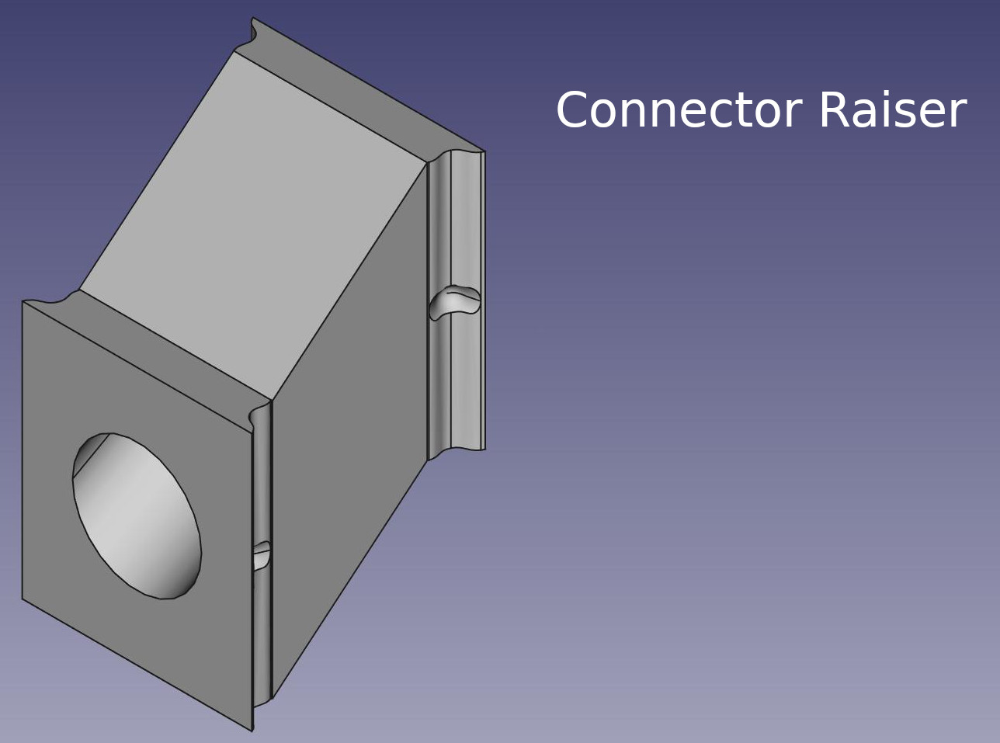
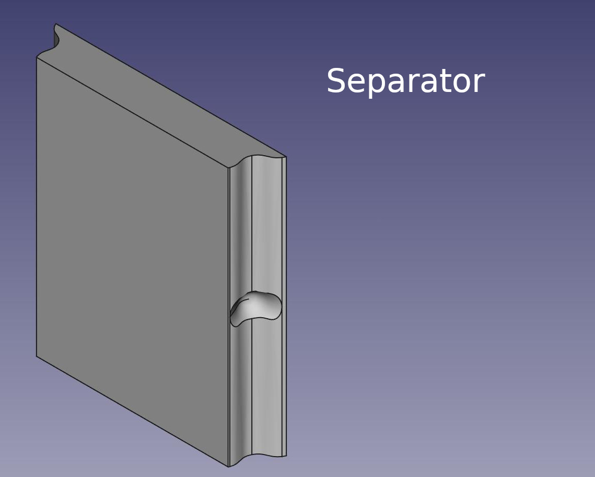

# OpenFormicaria - Connectors

The images will be for CV2 mostly, though in most cases the information is valid for both version, if not explicitly said so.

## Print recommendation
### CV2 (recommended)
You have to use TPU or a similar flexible material.

* 0.2mm layer height is fine
* 15% infill
* Tube connectors require support, everything else can be printed without

### CV1
PLA is fine for most connectors, though the tube connector will not work properly with PLA.

* 0.2mm layer height is fine
* 15% infill
* Tube connectors require support as well as has to be printed with TPU, everything else can be printed without supports

## Main Connector 

This connector connects two modules together, simple enough.

## Connector blocker

Same formfactor as the Main connector but it blocks the path.

## Tube Connectors for 10mm, 12mm and 14mm inner circumference

A variation of tube connectors. The test-/tubes go over the connector, not in.

**IMPORTANT**! Do not print this with PLA, use a flexible filament.

## Tube Connectors on an 90° angle for 10mm, 12mm and 14mm inner circumference

A variation of tube connectors. The test-/tubes go over the connector, not in.

IMPORTANT! Do not print this with PLA, use a flexible filament.

## Blocking Endpoint

A bit nicer looking than a block connector but cannot be used to connect two modules

## Connector Raiser 

This connector allows you to connect a modules like a Portal to a formicarium which is higher above due to the basin. Now there is no more floating modules.

## Separator (CV2 only)

This "connector" allows you to separate two connected modules and block both entries. I recommend to print at least a pair of these for your setup.
